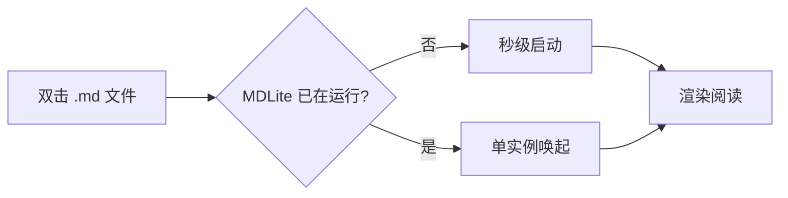

# MDLite 演示文档

> 这是一份用于体验 **MDLite** 全部渲染能力的示例文档。点击任意标题可以折叠 / 展开章节；右侧「大纲」面板可快速跳转。

## 什么是 MDLite

MDLite 是一个**轻、快、离线**的 Markdown 阅读器：

- 单文件可执行程序，无需安装
- 不依赖网络 —— 公式、图表、代码高亮全部本地渲染
- 基于 Tauri 与系统自带 WebView，**没有 Electron**
- 支持 Windows 与 macOS

打开方式：直接把 `.md` 文件拖进窗口，或在菜单中选择「打开文件」。

## 常用语法速览

### 文本样式

**粗体**、*斜体*、~~删除线~~、`行内代码`，还有 [外部链接](https://github.com/drhenriquetea/MDLook)（会在系统浏览器打开）。

> 引用块：简洁，但不简陋。
> 适合放旁注、出处和提醒。

### 任务列表

- [x] 打开 MDLite
- [x] 阅读这份演示
- [ ] 试试编辑模式（`Ctrl+E`）
- [ ] 把 MDLite 设为 `.md` 的默认打开方式

### 表格

| 功能 | 阅读模式 | 编辑模式 |
| --- | :---: | :---: |
| 大纲导航 | ✓ | ✓ |
| 实时预览 | — | ✓ |
| 章节折叠 | ✓ | ✓ |
| 查找 | ✓ | ✓ |

## 代码高亮

```python
def fib(n: int) -> int:
    """返回第 n 个斐波那契数"""
    a, b = 0, 1
    for _ in range(n):
        a, b = b, a + b
    return a

print([fib(i) for i in range(10)])
```

```rust
fn main() {
    let msg = "Hello, MDLite!";
    println!("{msg}");
}
```

## 数学公式

行内公式：质能方程 $E = mc^2$，欧拉公式 $e^{i\pi} + 1 = 0$。

独立公式（高斯积分）：

$$
\int_{-\infty}^{\infty} e^{-x^2} \, dx = \sqrt{\pi}
$$

## 图表（Mermaid）



## 相对路径图片


上图的地址是相对本文件的 `assets/preview.png`，MDLite 会自动解析并显示。

## 长内容测试

### 中文排版

中文与 English 混排的行高、字重与标点悬挂都经过调校。段落之间保持呼吸感，正文列宽固定在适合阅读的宽度，避免长行造成的视觉疲劳。你可以用顶栏的按钮或菜单调整字号与阅读宽度。

### 列表嵌套

1. 第一层
   1. 第二层有序
   2. 继续计数
2. 回到第一层
   - 无序嵌套
     - 更深一层
       - 叶子节点

---

**试试看**：点击上面的「长内容测试」标题把它折叠起来，再在大纲里点击「代码高亮」直接跳转。
